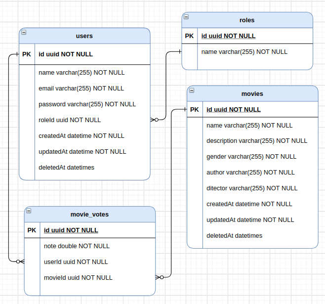

# IMDb API
### Anatomia do projeto

```
 src
    └ app
       └ use-case
    └ domain
    └ infra
       └ adapters
       └ composers
       └ config
       └ repositories
       └ web-server
    └ presenters
       └ controllers
 └ node_modules (generated)


```

### Modelo de dados DB


### Documentação
```
https://documenter.getpostman.com/view/14483210/Tzsco6Gx
```

### Rodar projeto
```
1 - Criar banco de dados imdb_api;
2 - Criar arquivo .env e colocar os valores do banco mysql;
3 - Rodar docker-compose up;

```
